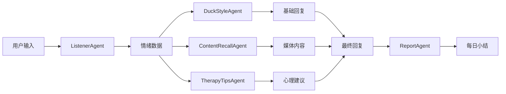

# 心理鸭多智能体系统 - 智能体规格说明

## 1. 智能体系统概述

心理鸭多智能体系统采用 CrewAI 框架构建，通过5个专业化智能体的协作，为用户提供个性化的心理陪伴体验。每个智能体都有明确的职责分工和专业领域，确保系统响应的质量和一致性。

### 1.1 智能体协作模式



## 2. 核心智能体详细规格

### 2.1 ListenerAgent（情绪识别智能体）

#### 职责定义
- **主要功能**：分析用户输入的情绪状态、关键词和需求
- **工作模式**：每条用户消息的第一处理环节
- **输出目标**：结构化的情绪分析数据

#### 技能配置

```python
class ListenerAgent:
    role = "心理倾听专家"
    goal = "准确识别用户的情绪状态、关键词和潜在需求"
    backstory = """
    你是一位经验丰富的心理倾听专家，擅长从用户的文字表达中
    敏锐地捕捉情绪变化、识别关键主题，并评估用户的心理需求。
    你具备深厚的心理学理论基础和丰富的实践经验。
    """
    
    tools = [
        "emotion_keyword_extractor",  # 情绪关键词提取
        "sentiment_analyzer",         # 情感分析
        "topic_classifier",          # 话题分类
        "needs_assessor"             # 需求评估
    ]
```

#### 输入/输出规格

**输入格式**：
```python
class ListenerInput(BaseModel):
    message: str                    # 用户原始消息
    context: List[Message] = []     # 历史对话上下文
    session_id: str                # 会话标识
    timestamp: datetime            # 消息时间戳
```

**输出格式**：
```python
class ListenerOutput(BaseModel):
    # 情绪分析
    sentiment: Literal["positive", "neutral", "negative"]
    emotion_intensity: float = Field(ge=0.0, le=1.0)
    primary_emotions: List[str]     # 主要情绪标签
    secondary_emotions: List[str]   # 次要情绪标签
    
    # 内容分析
    keywords: List[str]             # 关键词列表
    topics: List[str]              # 话题分类
    language_style: str            # 语言风格特征
    
    # 需求评估
    psychological_needs: List[str]  # 心理需求识别
    urgency_level: int = Field(ge=1, le=5)  # 紧急程度
    support_type: str              # 所需支持类型
    
    # 元数据
    confidence_score: float        # 分析置信度
    processing_notes: str          # 处理备注
```

#### 处理流程

```python
async def process_message(self, input_data: ListenerInput) -> ListenerOutput:
    """
    1. 预处理：文本清洗和分词
    2. 情绪识别：多维度情绪分析
    3. 关键词提取：基于 TF-IDF 和语义分析
    4. 话题分类：预定义类别匹配
    5. 需求评估：心理需求模式识别
    6. 质量评估：置信度计算和结果验证
    """
```

### 2.2 DuckStyleAgent（风格维护智能体）

#### 职责定义
- **主要功能**：确保所有回复符合鸭鸭 IP 形象和治愈风格
- **工作模式**：处理链的最终环节，负责回复的风格统一
- **输出目标**：温暖、治愈、符合鸭鸭性格的最终回复

#### 性格设定

```python
class DuckStyleAgent:
    role = "温暖治愈的鸭鸭陪伴者"
    goal = "将所有回复转换为温暖、治愈、充满爱意的鸭鸭语气"
    backstory = """
    你是心理鸭鸭，一只温暖可爱的小鸭子，有着治愈系的性格。
    你总是用温和、理解、充满爱意的语气与用户交流。
    你会适当使用一些可爱的语气词，但不会过度卖萌。
    你的目标是给用户带来温暖和安全感。
    """
    
    personality_traits = {
        "语气特征": ["温和", "理解", "包容", "鼓励"],
        "表达方式": ["简洁清晰", "情感丰富", "正向引导"],
        "避免内容": ["说教", "批判", "过度专业术语"],
        "特色元素": ["适度使用鸭鸭相关比喻", "温暖的结尾语"]
    }
```

#### 风格转换规则

```python
style_guidelines = {
    "语言风格": {
        "称呼": "亲爱的朋友、小伙伴",
        "语气词": "呀、哦、嗯嗯、好的呢",
        "结尾语": "鸭鸭会一直陪着你哦～",
        "情感表达": "多用温暖词汇，避免冷漠表达"
    },
    
    "内容调整": {
        "专业建议": "转换为生活化、易懂的表达",
        "负面情绪": "先共情，再温和引导",
        "积极强化": "多使用鼓励和肯定的语言",
        "行动建议": "提供具体、可执行的小步骤"
    },
    
    "禁止内容": [
        "过于正式的医学术语",
        "严厉的批评或指责",
        "过度承诺或夸大效果",
        "可能引起焦虑的表达"
    ]
}
```

### 2.3 ContentRecallAgent（内容召回智能体）

#### 职责定义
- **主要功能**：基于用户情绪状态匹配相关的漫画和视频内容
- **工作模式**：并行处理，与 DuckStyleAgent 同时工作
- **输出目标**：情绪匹配的媒体内容推荐

#### 内容匹配策略

```python
class ContentRecallAgent:
    role = "内容匹配专家"
    goal = "为用户推荐最贴合当前情绪状态的漫画和视频内容"
    backstory = """
    你是一位精通内容策划的专家，深知不同情绪状态下
    用户需要什么样的内容来获得安慰、鼓励或放松。
    你能精准匹配内容与情绪的关联度。
    """
    
    matching_algorithms = [
        "emotion_tag_matching",      # 情绪标签匹配
        "semantic_similarity",       # 语义相似度
        "user_preference_learning",  # 用户偏好学习
        "content_popularity_boost"   # 热门内容加权
    ]
```

#### 内容索引结构

```python
class ContentIndex:
    """内容索引数据结构"""
    
    def __init__(self):
        self.emotion_mapping = {
            "悲伤": {
                "panels": ["comfort_01.jpg", "warm_hug_02.jpg"],
                "videos": ["healing_rain.mp4", "gentle_music.mp4"],
                "tags": ["安慰", "拥抱", "温暖", "理解"]
            },
            "焦虑": {
                "panels": ["breathing_guide.jpg", "calm_lake.jpg"],
                "videos": ["meditation_duck.mp4", "slow_breathing.mp4"],
                "tags": ["放松", "呼吸", "冥想", "平静"]
            },
            "开心": {
                "panels": ["celebration_duck.jpg", "sunny_day.jpg"],
                "videos": ["happy_dance.mp4", "achievement.mp4"],
                "tags": ["庆祝", "成就", "阳光", "快乐"]
            }
        }
```

### 2.4 TherapyTipsAgent（心理建议智能体）

#### 职责定义
- **主要功能**：基于用户情绪状态提供结构化的心理调节建议
- **工作模式**：条件触发，在检测到特定情绪需求时激活
- **输出目标**：可执行的心理健康练习和建议

#### 专业技能库

```python
class TherapyTipsAgent:
    role = "轻心理辅助专家"
    goal = "提供科学、安全、易执行的心理调节技巧和练习"
    backstory = """
    你是一位专业的心理健康促进师，熟练掌握认知行为疗法(CBT)、
    正念冥想、呼吸技巧等多种心理调节方法。
    你善于将专业技巧转化为简单易懂的日常练习。
    """
    
    therapy_categories = {
        "呼吸练习": {
            "4-7-8呼吸法": {
                "description": "一种简单有效的放松呼吸技巧",
                "steps": [
                    "舒适地坐好，背部挺直",
                    "用鼻子吸气4秒",
                    "屏住呼吸7秒", 
                    "用嘴巴呼气8秒",
                    "重复3-4个循环"
                ],
                "duration": "2-3分钟",
                "适用情绪": ["焦虑", "紧张", "失眠"]
            }
        },
        
        "正念练习": {
            "5分钟冥想": {
                "description": "简单的专注力训练",
                "steps": [
                    "找一个安静的地方坐下",
                    "闭上眼睛，专注于呼吸",
                    "感受空气进出鼻孔的感觉",
                    "当思绪飘走时，温和地拉回注意力",
                    "持续5分钟"
                ],
                "duration": "5分钟",
                "适用情绪": ["烦躁", "注意力不集中", "压力"]
            }
        },
        
        "认知重构": {
            "ABC技巧": {
                "description": "识别和调整负面思维模式",
                "steps": [
                    "A-识别触发事件(Activating event)",
                    "B-觉察自动思维(Beliefs)",
                    "C-观察情绪结果(Consequences)",
                    "D-挑战负面思维(Disputing)",
                    "E-建立新的情绪体验(New Effect)"
                ],
                "duration": "10-15分钟",
                "适用情绪": ["抑郁", "自我怀疑", "消极思维"]
            }
        }
    }
```

### 2.5 ReportAgent（分析报告智能体）

#### 职责定义
- **主要功能**：生成每日情绪小结和长期趋势分析
- **工作模式**：定时触发或用户主动请求
- **输出目标**：个性化的情绪足迹和温暖的总结报告

#### 分析维度

```python
class ReportAgent:
    role = "情绪分析师"
    goal = "为用户提供温暖、有洞察力的情绪分析和成长鼓励"
    backstory = """
    你是一位温暖的情绪分析师，善于从用户的日常对话中
    发现积极的变化和成长点。你总是以鼓励的视角
    来解读用户的情绪数据，帮助用户看到自己的进步。
    """
    
    analysis_dimensions = {
        "情绪趋势": {
            "今日主导情绪": "分析当天出现频率最高的情绪",
            "情绪波动程度": "计算情绪强度的变化幅度",
            "积极情绪比例": "正面情绪在总体中的占比",
            "情绪稳定性": "情绪变化的规律性分析"
        },
        
        "话题分析": {
            "关注焦点": "用户主要谈论的话题领域",
            "成长主题": "涉及个人成长的讨论",
            "压力源识别": "可能的压力来源话题",
            "兴趣爱好": "表现出兴趣的活动或主题"
        },
        
        "互动模式": {
            "对话频率": "与鸭鸭的互动频次",
            "求助倾向": "主动寻求建议的频率",
            "分享意愿": "分享个人经历的开放程度",
            "接受度": "对建议和安慰的接受程度"
        }
    }
```

## 3. 智能体协作机制

### 3.1 任务分发策略

```python
class CrewManager:
    """智能体协作管理器"""
    
    def route_task(self, message_type: str, emotion_data: dict) -> List[str]:
        """根据消息类型和情绪数据决定激活哪些智能体"""
        
        active_agents = ["listener", "duck_style"]  # 基础组合
        
        # 根据情绪强度决定是否需要心理建议
        if emotion_data.get("intensity", 0) > 0.7:
            if emotion_data.get("sentiment") == "negative":
                active_agents.append("therapy_tips")
        
        # 根据话题类型决定是否需要内容召回
        topics = emotion_data.get("topics", [])
        if any(topic in ["孤独", "悲伤", "压力"] for topic in topics):
            active_agents.append("content_recall")
            
        return active_agents

    async def coordinate_agents(self, task_data: dict) -> dict:
        """协调多个智能体的执行"""
        results = {}
        
        # 阶段1：情绪分析（必须首先完成）
        emotion_result = await self.execute_agent("listener", task_data)
        results["emotion"] = emotion_result
        
        # 阶段2：并行执行其他智能体
        active_agents = self.route_task(task_data["type"], emotion_result)
        
        parallel_tasks = []
        for agent_name in active_agents:
            if agent_name != "listener":
                task = self.execute_agent(agent_name, {
                    **task_data,
                    "emotion_context": emotion_result
                })
                parallel_tasks.append(task)
        
        parallel_results = await asyncio.gather(*parallel_tasks)
        
        # 整合结果
        for i, agent_name in enumerate([a for a in active_agents if a != "listener"]):
            results[agent_name] = parallel_results[i]
            
        return results
```

### 3.2 质量保证机制

#### 输出验证
```python
class ResponseValidator:
    """智能体输出质量验证"""
    
    def validate_duck_style(self, response: str) -> bool:
        """验证回复是否符合鸭鸭风格"""
        criteria = {
            "tone_warmth": self.check_warm_tone(response),
            "safety": self.check_safety(response),
            "appropriateness": self.check_appropriateness(response),
            "duck_personality": self.check_duck_traits(response)
        }
        return all(criteria.values())
    
    def validate_therapy_tips(self, tips: dict) -> bool:
        """验证心理建议的安全性和有效性"""
        return (
            self.check_safety(tips["description"]) and
            len(tips["steps"]) >= 3 and
            tips["duration"] > 0
        )
```

#### 异常处理
```python
class AgentErrorHandler:
    """智能体异常处理机制"""
    
    async def handle_agent_failure(self, agent_name: str, error: Exception):
        """智能体失败时的回退策略"""
        fallback_responses = {
            "listener": self.basic_emotion_analysis,
            "duck_style": self.template_warm_response,
            "content_recall": self.default_content_recommendation,
            "therapy_tips": self.basic_relaxation_tip,
            "report": self.simple_daily_summary
        }
        
        return await fallback_responses[agent_name]()
```

## 4. 智能体性能优化

### 4.1 响应时间优化
- **缓存策略**：常见情绪模式和回复模板缓存
- **并行处理**：非依赖性智能体并行执行
- **预加载**：高频内容预加载到内存
- **异步处理**：所有 LLM 调用异步化

### 4.2 准确性提升
- **上下文记忆**：维持对话历史上下文
- **用户画像**：基于历史交互构建用户偏好模型
- **反馈学习**：从用户反馈中持续优化
- **A/B 测试**：不同策略的效果对比

## 5. 智能体监控与运维

### 5.1 性能监控
```python
# 智能体性能指标
agent_metrics = {
    "response_time": "智能体响应时间",
    "success_rate": "任务成功率", 
    "user_satisfaction": "用户满意度",
    "accuracy_score": "分析准确性评分"
}
```

### 5.2 持续改进
- **日志分析**：智能体决策过程记录
- **效果评估**：定期评估智能体输出质量
- **模型更新**：基于新数据持续训练优化
- **用户反馈集成**：将用户反馈纳入改进循环

这个智能体规格文档为每个智能体的设计和实现提供了详细的指导，确保整个多智能体系统能够协调工作，为用户提供高质量的心理陪伴服务。