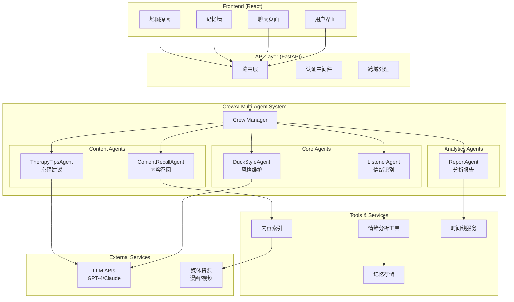
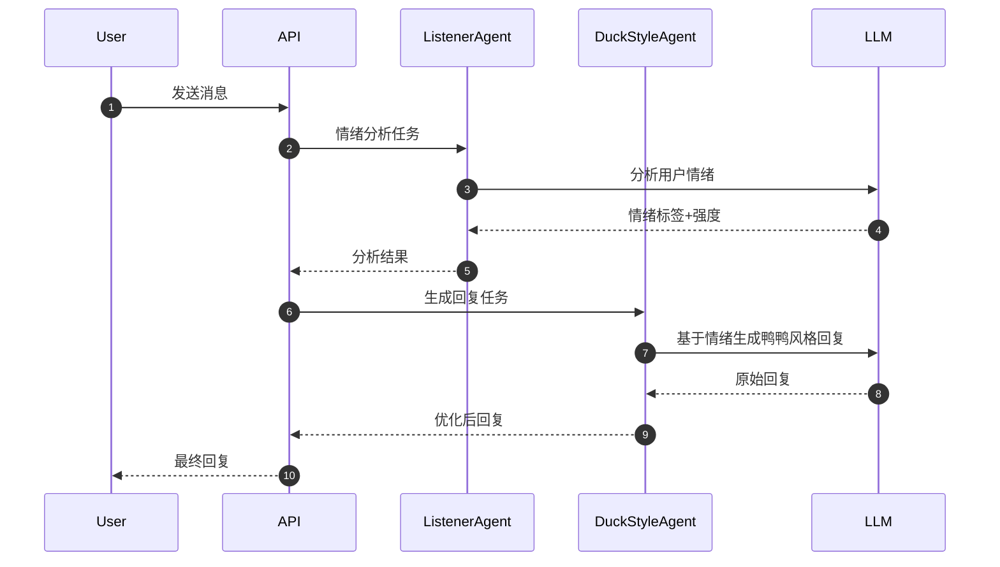
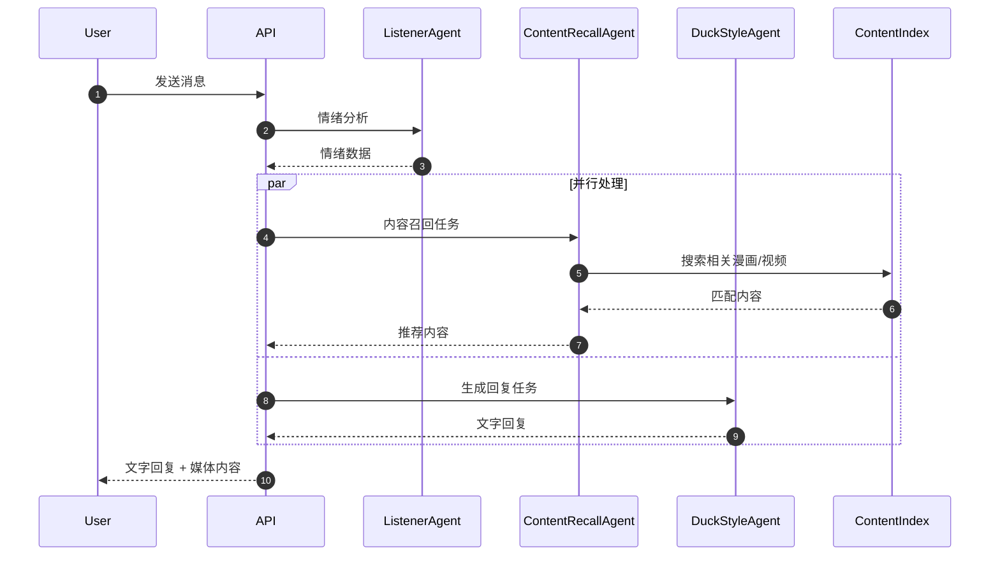

# 心理鸭对话多智能体系统架构文档

## 1. 系统概述

心理鸭后端是一个基于 CrewAI 的多智能体系统，旨在为前端 React 应用提供智能化的心理陪伴对话服务。系统通过多个专业化智能体的协作，实现情绪识别、内容召回、心理建议生成和每日小结等功能。

### 1.1 设计理念

- **多智能体协作**：不同智能体负责不同的专业领域，提高响应质量和准确性
- **轻量级心理辅助**：提供正向心理学工具，而非专业心理治疗
- **IP 风格一致性**：维持鸭鸭角色的温暖、治愈风格
- **渐进式增强**：从基础对话到复杂心理分析的逐步实现

## 2. 整体架构

### 2.1 系统架构图



### 2.2 技术栈

#### 后端核心
- **FastAPI**: 高性能 Web 框架，提供 RESTful API
- **CrewAI**: 多智能体编排框架
- **Pydantic**: 数据验证和序列化
- **Uvicorn**: ASGI 服务器

#### 智能体相关
- **LangChain**: LLM 集成和工具链
- **OpenAI API**: GPT 模型接入
- **Anthropic API**: Claude 模型备选
- **jieba**: 中文分词和关键词提取

#### 数据存储
- **SQLite**: 轻量级本地数据库（开发阶段）
- **PostgreSQL**: 生产环境数据库
- **Redis**: 缓存和会话存储

#### 部署和监控
- **Docker**: 容器化部署
- **uvloop**: 高性能事件循环
- **loguru**: 结构化日志
- **prometheus-client**: 监控指标

## 3. 智能体系统设计

### 3.1 CrewAI 架构模式

```python
# Crew 组织结构
class DuckTherapyCrew:
    def __init__(self):
        self.agents = {
            'listener': ListenerAgent(),
            'duck_style': DuckStyleAgent(),
            'content_recall': ContentRecallAgent(),
            'therapy_tips': TherapyTipsAgent(),
            'report': ReportAgent()
        }
        
    def create_crew(self, task_type: str):
        # 根据任务类型动态组织不同的智能体组合
        if task_type == "chat":
            return [self.agents['listener'], self.agents['duck_style']]
        elif task_type == "therapy":
            return [self.agents['listener'], self.agents['therapy_tips'], self.agents['duck_style']]
        # ... 其他组合
```

### 3.2 智能体协作流程

#### 基础对话流程


#### 增强对话流程（包含内容召回）


## 4. 数据架构

### 4.1 核心数据模型

```python
# 消息模型
class Message(BaseModel):
    id: str = Field(default_factory=lambda: str(uuid.uuid4()))
    role: Literal["user", "duck"]
    text: str
    emotion_tags: Optional[List[str]] = None
    emotion_intensity: Optional[float] = None
    panel_url: Optional[str] = None
    video_url: Optional[str] = None
    created_at: datetime = Field(default_factory=datetime.now)
    session_id: str

# 情绪分析结果
class EmotionAnalysis(BaseModel):
    sentiment: Literal["positive", "neutral", "negative"]
    intensity: float = Field(ge=0.0, le=1.0)
    emotion_tags: List[str]
    keywords: List[str]
    topics: List[str]
    needs_assessment: Optional[str] = None

# 内容资源
class ContentAsset(BaseModel):
    id: str
    type: Literal["image", "video"]
    url: str
    title: str
    tags: List[str]
    emotion_relevance: Dict[str, float]  # 情绪相关度评分
    usage_count: int = 0
    
# 心理建议
class TherapyTip(BaseModel):
    id: str
    category: str  # "breathing", "mindfulness", "cbt", etc.
    title: str
    description: str
    steps: List[str]
    duration_minutes: int
    difficulty: Literal["easy", "medium", "hard"]
```

### 4.2 数据库设计

```sql
-- 用户会话表
CREATE TABLE sessions (
    id VARCHAR(36) PRIMARY KEY,
    user_id VARCHAR(36),
    created_at TIMESTAMP DEFAULT CURRENT_TIMESTAMP,
    last_active TIMESTAMP DEFAULT CURRENT_TIMESTAMP,
    metadata JSONB
);

-- 消息表
CREATE TABLE messages (
    id VARCHAR(36) PRIMARY KEY,
    session_id VARCHAR(36) REFERENCES sessions(id),
    role VARCHAR(10) NOT NULL,
    text TEXT NOT NULL,
    emotion_data JSONB,
    media_content JSONB,
    created_at TIMESTAMP DEFAULT CURRENT_TIMESTAMP
);

-- 内容索引表
CREATE TABLE content_assets (
    id VARCHAR(36) PRIMARY KEY,
    type VARCHAR(10) NOT NULL,
    url TEXT NOT NULL,
    title VARCHAR(255),
    tags TEXT[],
    emotion_scores JSONB,
    usage_count INTEGER DEFAULT 0,
    created_at TIMESTAMP DEFAULT CURRENT_TIMESTAMP
);

-- 情绪记录表
CREATE TABLE emotion_logs (
    id VARCHAR(36) PRIMARY KEY,
    session_id VARCHAR(36) REFERENCES sessions(id),
    emotion_data JSONB NOT NULL,
    timestamp TIMESTAMP DEFAULT CURRENT_TIMESTAMP
);
```

## 5. API 设计

### 5.1 RESTful 端点设计

```python
# 主要 API 端点
@app.post("/api/v1/chat")
async def chat_endpoint(message: ChatRequest) -> ChatResponse:
    """主要聊天接口"""
    
@app.get("/api/v1/emotions/analysis/{session_id}")
async def get_emotion_analysis(session_id: str) -> EmotionAnalysisResponse:
    """获取情绪分析结果"""
    
@app.post("/api/v1/content/recommend")
async def recommend_content(request: ContentRequest) -> ContentResponse:
    """基于情绪推荐内容"""
    
@app.get("/api/v1/reports/daily/{session_id}")
async def generate_daily_report(session_id: str) -> DailyReportResponse:
    """生成每日情绪报告"""
```

### 5.2 WebSocket 实时通信

```python
@app.websocket("/ws/chat/{session_id}")
async def websocket_chat(websocket: WebSocket, session_id: str):
    """实时聊天 WebSocket 连接"""
    await websocket.accept()
    
    async for message in websocket.iter_text():
        # 处理实时消息
        response = await process_chat_message(message, session_id)
        await websocket.send_json(response)
```

## 6. 安全与隐私

### 6.1 数据保护策略

- **用户隐私**：所有对话数据本地加密存储
- **会话隔离**：基于 session_id 的严格数据隔离
- **API 安全**：Rate limiting 和请求验证
- **敏感信息过滤**：智能体自动识别和保护个人敏感信息

### 6.2 合规性考虑

- **数据最小化原则**：只收集必要的用户交互数据
- **用户控制权**：用户可随时删除个人数据
- **透明度**：清晰的数据使用说明
- **AI 伦理**：避免有害建议，强调专业心理帮助的重要性

## 7. 性能与扩展性

### 7.1 性能优化策略

- **智能体缓存**：常用回复和分析结果缓存
- **异步处理**：所有 LLM 调用异步执行
- **连接池管理**：数据库和外部 API 连接优化
- **内容 CDN**：媒体资源分发加速

### 7.2 扩展性设计

- **模块化架构**：智能体可独立部署和扩展
- **负载均衡**：支持多实例部署
- **数据库分片**：按时间或用户分片存储
- **微服务拆分**：核心功能可拆分为独立服务

## 8. 监控与运维

### 8.1 监控指标

- **业务指标**：对话质量、用户满意度、智能体响应时间
- **技术指标**：API 响应时间、错误率、资源使用率
- **成本监控**：LLM API 调用成本、存储成本

### 8.2 日志体系

```python
# 结构化日志示例
logger.info("Agent processing", extra={
    "agent_type": "listener",
    "session_id": session_id,
    "message_id": message_id,
    "processing_time_ms": processing_time,
    "emotion_detected": emotion_tags
})
```

## 9. 部署架构

### 9.1 开发环境
- **本地开发**：Docker Compose 一键启动
- **热重载**：代码变更自动重启
- **模拟数据**：内置测试数据和 mock 服务

### 9.2 生产环境
- **容器化部署**：Docker + Kubernetes
- **服务发现**：Consul 或 Kubernetes 原生
- **配置管理**：环境变量 + ConfigMap
- **密钥管理**：Kubernetes Secrets

这个架构文档为整个多智能体系统提供了清晰的技术蓝图，确保开发团队对系统设计有统一的理解，并为后续的详细实现提供指导。