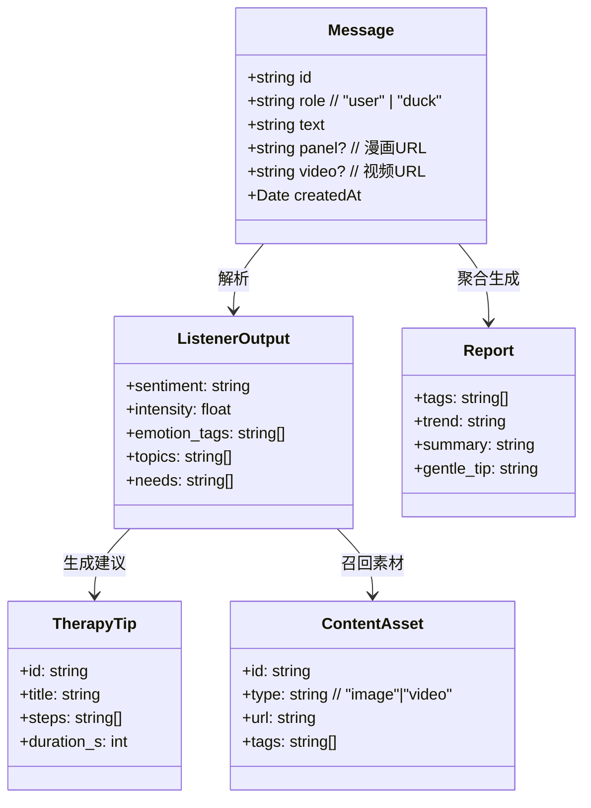
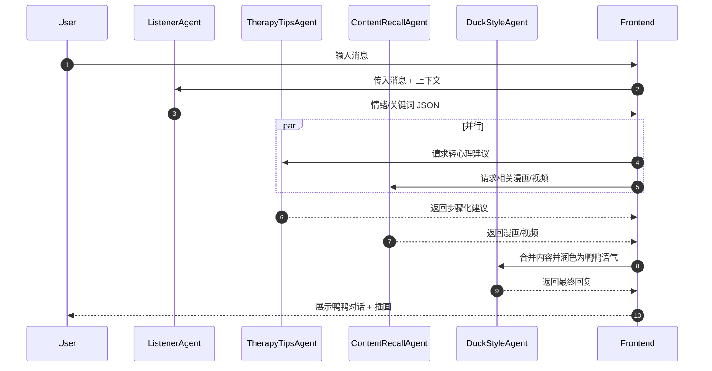
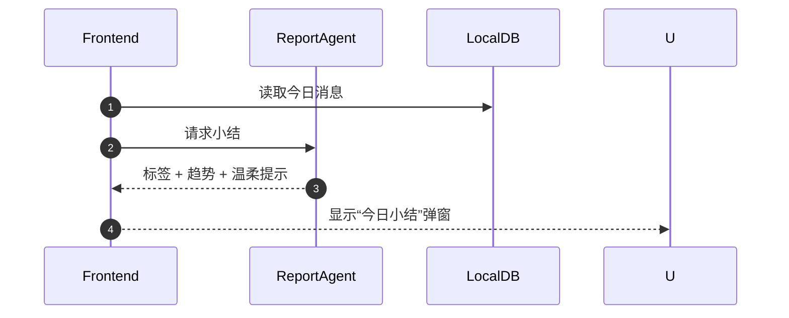

# 心理鸭对话多智能体 PRD & 架构文档

## 一、产品需求文档（PRD）

### 1. 产品定位

心理鸭是一个以 IP（鸭鸭漫画形象）为核心的 **轻陪伴对话应用**，通过拟人化、疗愈风格的多智能体协作，实现：

* 情绪倾听与陪伴
* 简单的心理调节建议
* 漫画/视频素材的贴合式回应
* 每日对话小结与情绪足迹

### 2. 核心目标

* **降低使用门槛**：点开即可聊天
* **维持 IP 风格**：语言与插画统一
* **轻心理辅助**：提供正向心理学的工具（呼吸练习、正念练习、CBT重述）
* **形成闭环**：对话 → 情绪识别 → 建议 → 记忆沉淀 → 小结

### 3. 主要功能

1. **对话陪伴**

   * 即时聊天（鸭鸭语气）
   * 插入漫画/视频片段
2. **轻心理建议**

   * 情绪调节小练习
   * 正念/呼吸引导
3. **内容召回**

   * 从已有漫画/视频库中匹配内容
4. **小结生成**

   * 当日情绪趋势、关键词标签、温柔鼓励
5. **情绪足迹**

   * 保存到本地数据库，形成时间轴

---

## 二、技术架构文档

### 1. 技术栈

* **前端**：React + TypeScript + TailwindCSS + shadcn/ui（你已实现）
* **后端（可轻量化）**：FastAPI / Flask（REST接口层）
* **智能体框架**：CrewAI（或基于 LangChain 多Agent编排）
* **存储**：

  * 本地：IndexedDB（对话、足迹、记忆）
  * 静态内容：content.json 索引 + CDN漫画/视频资源
* **模型**：

  * LLM：GPT 系列 / 本地 LLM
  * 规则/关键词：情绪识别、内容匹配

---

### 2. 项目结构（建议）

```
duck-therapy-ai/
├── frontend/                  # 已实现的 React 前端
│   └── ...
├── backend/
│   ├── app.py                 # FastAPI 主入口
│   ├── agents/                # 多智能体定义
│   │   ├── listener_agent.py
│   │   ├── tips_agent.py
│   │   ├── recall_agent.py
│   │   ├── duckstyle_agent.py
│   │   └── report_agent.py
│   ├── tools/                 # 工具函数
│   │   ├── keyword_tag.py
│   │   ├── sentiment.py
│   │   └── content_index.py
│   ├── data/
│   │   └── content.json       # 漫画/视频索引
│   └── tests/
│       └── ...
├── docs/
│   ├── prd.md
│   ├── architecture.md
│   └── diagrams/              # 类图/时序图
└── requirements.txt
```

---

### 3. 类图（Class Diagram）



---

### 4. 时序图（Sequence Diagrams）

#### 单轮对话流程



#### 每日小结流程



---

## 三、迭代计划（高层）

* **MVP-0.1**：对话闭环（Listener + DuckStyle + 前端展示）
* **MVP-0.2**：接入漫画/视频召回（ContentRecall）
* **MVP-0.3**：加入 TherapyTips，输出可执行练习
* **MVP-0.4**：生成 Report（情绪足迹 + 今日小结）
* **MVP-0.5**：优化体验，灰度上线
