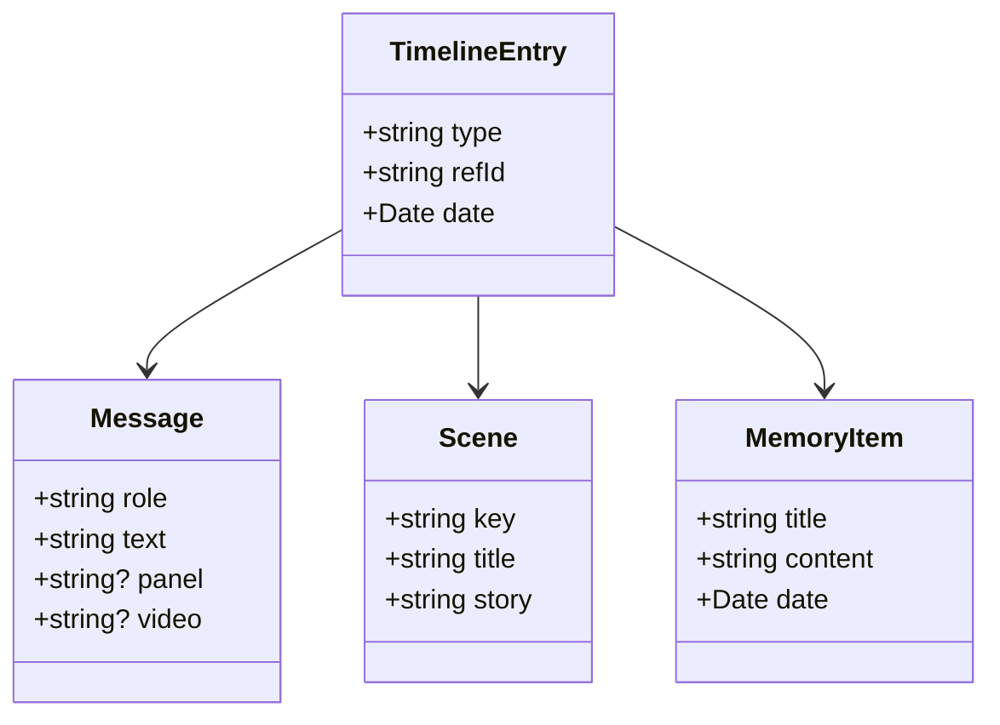
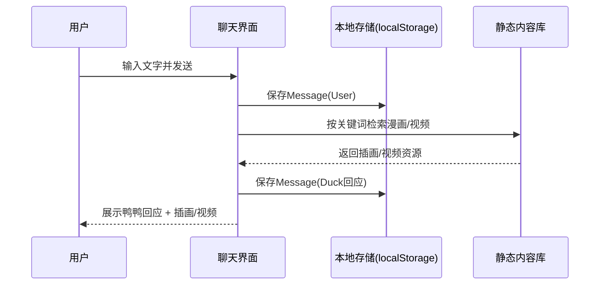
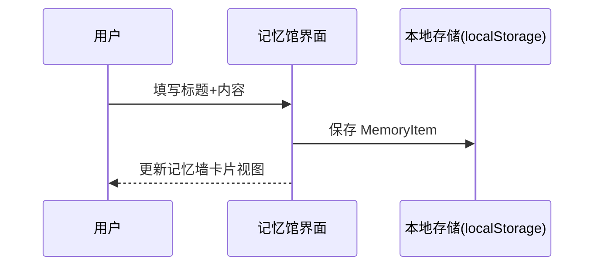
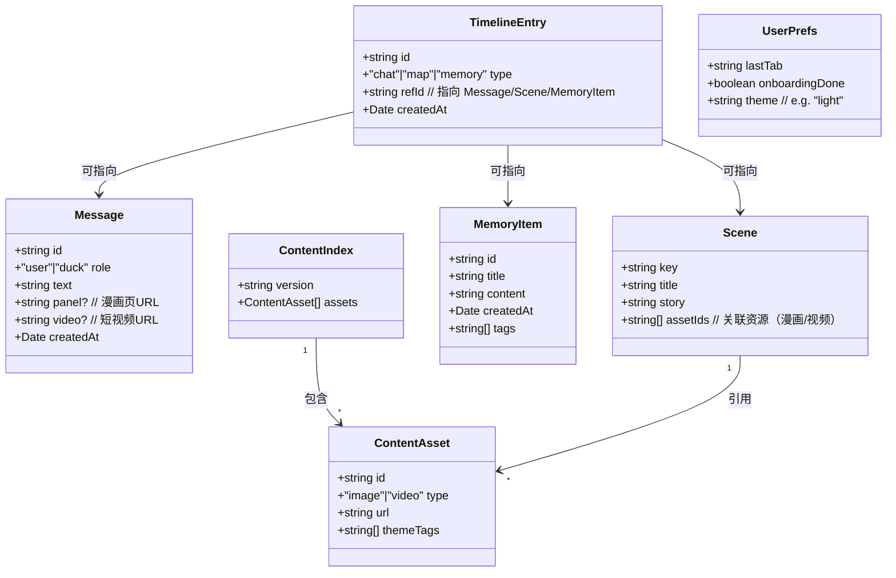
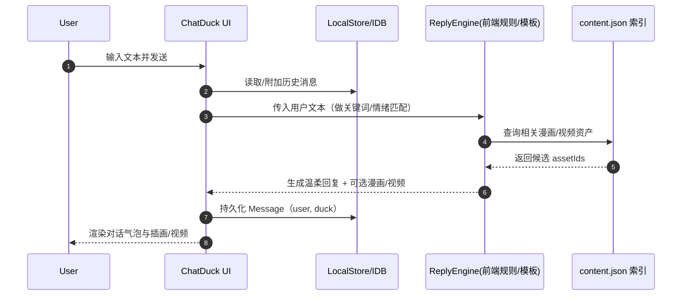
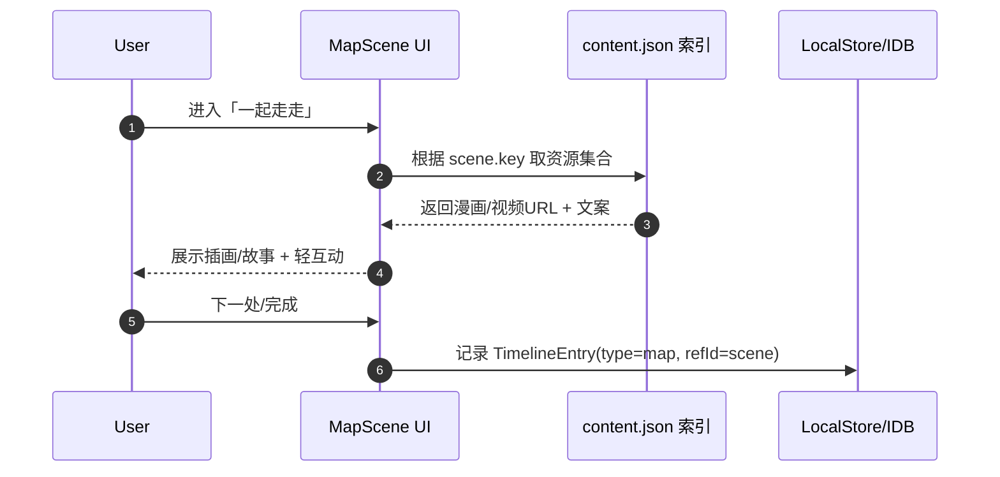
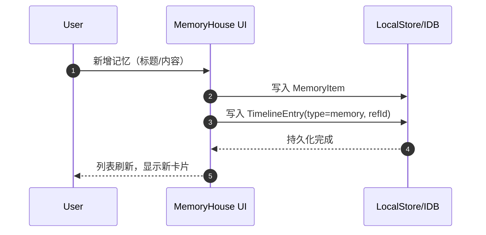

# 心理鸭 MVP 架构文档（简化版，无后端）

## 1. 目标与范围
- **目标**：实现心理鸭的核心三大体验 —— 聊天、地图探索、记忆封存。
- **范围**：仅客户端实现（React + shadcn/ui），不涉及独立后端。数据保存在前端状态或本地存储。
- **非目标**：暂不接入在线数据库、用户鉴权、复杂推荐系统。

---

## 2. 系统总览
- **应用类型**：单页应用（SPA）。
- **技术栈**：React + TailwindCSS + shadcn/ui。
- **状态管理**：MVP 使用 React useState/useContext；后续可扩展 Zustand/Recoil。
- **存储**：本地存储（localStorage/IndexedDB）用于：
  - 用户记忆封存（记忆馆）
  - 情绪足迹
  - 对话历史（可选）

---

## 3. 客户端架构

### 页面（与底部导航一致）
1. **首页**
   - 动态鸭鸭 + 今日暖心话
   - 三大功能入口

2. **聊天**
   - 对话界面（输入区、对话气泡区）
   - 漫画/视频展示（静态资源）
   - 模拟回复（预置模板 + 简单逻辑）

3. **地图**
   - 虚拟地图（静态插画 + 文本）
   - 简单场景切换
   - 漫画/视频片段展示

4. **记忆馆**
   - 漫画墙（卡片视图）
   - 新增记忆（文字/插画封存）
   - 本地存储持久化

5. **情绪足迹**（后续迭代）
   - 时间轴视图
   - 关联聊天/地图/记忆

### 组件
- **基础组件**：WarmButton, StoryBubble, NavItem
- **功能组件**：ChatDuck, MapScene, MemoryHouse, WarmHeader

---

## 4. 内容资源管理
- **漫画PDF**：拆页为图片，放在 `/public/panels/`。
- **视频**：剪辑为 10–30s 短片，放在 `/public/videos/`。
- **调用方式**：
  - 聊天：关键词触发 → 漫画页/视频片段展示
  - 地图：场景节点 → 插画/视频片段展示
  - 记忆馆：用户上传文字生成卡片（漫画背景）

---

## 5. 数据与存储
- **数据模型（前端）**：
  - `Message { role, text, panel?, video? }`
  - `Scene { key, title, story }`
  - `MemoryItem { title, content, date }`
  - `TimelineEntry { type, refId, date }`
- **持久化**：localStorage
  - Key: `chatHistory`, `memories`, `timeline`

---

## 6. UI/UX 基线
- **风格**：漫画感、水彩色板、圆角大留白。
- **色彩**：鸭鸭黄 #F7D774，湖水蓝 #A5D8E2，暖橙 #F5A25D，背景米白 #FAF7F2。
- **动效**：淡入淡出、轻微浮动、眨眼。
- **文案语气**：邀请式、温柔陪伴。

---

## 7. 类图（Class Diagram）


---

## 8. 时序图（Sequence Diagram）
### 聊天流程示例


### 记忆封存流程示例


---

## 9. 观测与验证
- **埋点（本地或console模拟）**：
  - 每日打开次数
  - 聊天发送条数
  - 地图场景切换次数
  - 记忆新增次数
- **验证指标**：
  - 用户是否会反复打开（留存）
  - 是否积极使用记忆封存
  - 对话轮数是否 >3（沉浸感）

---

## 10. 迭代路径
- **MVP（当前）**：React 单页，本地存储，静态漫画/视频。
- **迭代 1**：增加情绪足迹时间轴。
- **迭代 2**：接入轻量后端（内容召回 / 用户账号）。
- **迭代 3**：点云/全景记忆馆，高级内容生成。


---

## 9. 类图（Class Diagram）
下图展示了 MVP 在前端-only 架构下的数据模型与关系（持久化至 localStorage/IndexedDB）。


```

---

## 10. 时序图（Sequence Diagrams）

### 10.1 聊天流程（前端生成 + 静态内容召回）


### 10.2 地图场景浏览（每日一个轻场景）


### 10.3 记忆封存（本地卡片）

