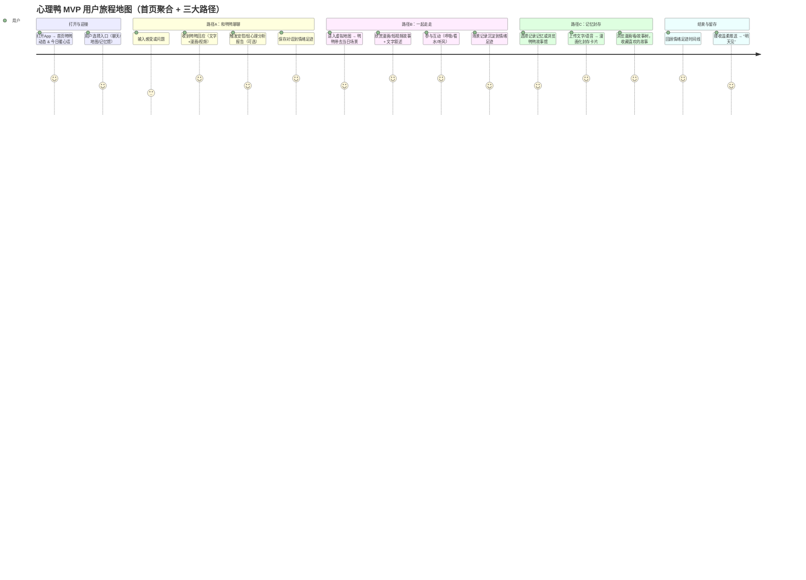
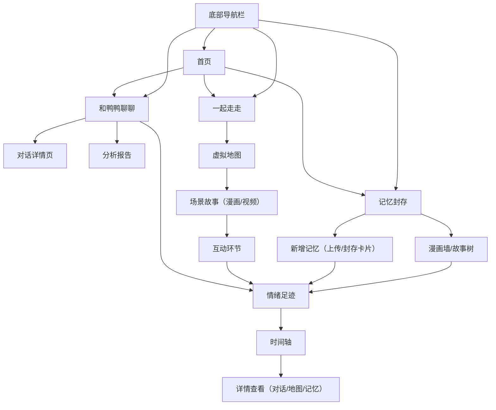

# **心理鸭 - MVP PRD**

---

## 1. 产品定位

心理鸭是一款以“鸭鸭”为核心IP的**轻度心理陪伴与记忆疗愈空间**应用。

* 用户可以和鸭鸭**对话、获得安慰**
* 在**地图探索**中体验鸭鸭的疗愈故事
* 在**记忆封存**中沉淀自己的生活与记忆
* 借助漫画和视频资源，打造独特的情绪陪伴体验

---

## 2. 目标用户

* 喜爱萌宠和漫画IP的年轻群体
* 有轻度情绪困扰，希望被理解与安慰的人
* 喜欢记录生活与收藏记忆的人
* 想要轻松、温柔的心理体验，而不是严肃心理App的用户

---

## 3. 核心功能（MVP）

### **3.1 首页**

* 动态心理鸭（随时间/天气/节气变化）
* 每日一句暖心话（漫画/插画/文字）
* 三大功能入口：

  1. 和鸭鸭聊聊
  2. 一起走走
  3. 记忆封存

---

### **3.2 和鸭鸭聊聊（对话系统）**

* 聊天模式（用户输入 ↔ 鸭鸭文字回应）
* 鸭鸭可插入漫画/视频作为回应
* 三层体验：

  * 陪伴闲聊
  * 情绪安慰
  * 轻心理分析报告（可选触发）

---

### **3.3 一起走走（地图探索）**

* 虚拟地图（水彩/漫画风，随季节变化）
* 每日鸭鸭带你去一个场景（森林、湖边、咖啡馆…）
* 场景包含：

  * 漫画/短视频故事
  * 一段1-2分钟文字故事
  * 简单互动（呼吸练习、听风声）

---

### **3.4 记忆封存（Memory House）**

* 用户上传（文字/图片/语音） → 封存为漫画风卡片
* 漫画墙/故事树形式展示
* 鸭鸭官方漫画/视频与用户记忆并列
* 未来可升级为点云/全景式记忆馆

---

### **3.5 情绪足迹**

* 自动沉淀：对话、场景、记忆
* 以时间轴展示用户的情绪旅程
* 可回顾和二次分享

---

### **3.6 被动陪伴**

* 推送 & 小组件 → 鸭鸭温柔提醒
* 示例：“今天要照顾好自己，我在等你哦～”

---

## 4. 底部导航栏设计（方案A）

```
首页 | 聊天 | 地图 | 记忆馆
```

* **首页**：IP聚合与今日暖心入口
* **聊天**：直接进入“和鸭鸭聊聊”
* **地图**：进入“一起走走”
* **记忆馆**：进入“记忆封存”

---

## 5. 用户旅程地图（Mermaid）



---

## 6. 页面规划

### **首页**

* 动态心理鸭（表情动画）
* 今日暖心话
* 三大功能入口卡片

### **和鸭鸭聊聊**

* 聊天区（对话气泡）
* 漫画/视频嵌入展示
* “保存到足迹”按钮
* 分析报告入口

### **一起走走**

* 地图界面（虚拟地图）
* 当日场景 → 插画/视频 + 故事文字
* 互动环节（轻动作/动画）
* 收藏按钮

### **记忆封存**

* 漫画墙/故事树UI
* “新增记忆”按钮 → 上传内容
* 封存卡片（漫画化呈现）
* 浏览/搜索/收藏

### **情绪足迹（聚合层）**

* 时间轴UI
* 点击条目 → 展示对话/地图/记忆详情
* 可分享出口

---

## 7. 数据埋点

* 首页打开率、入口点击率
* 对话时长、平均对话轮数
* 漫画/视频调用频率
* 记忆封存上传率
* 次日留存率

---

## 8. 开发优先级（MVP迭代）

### **第一阶段（必做）**

* 首页
* 聊天（文字+漫画/视频回应）
* 地图探索（2-3个场景）
* 记忆封存（简化漫画墙）

### **第二阶段（增强）**

* 情绪足迹
* 分析报告
* 被动陪伴推送

### **第三阶段（愿景）**

* 点云/全景记忆馆
* 季节地图大版本更新
* AI自动生成“漫画风记忆”

---

## 9. UI 风格要求

### **整体调性**

* **关键词**：温柔、疗愈、陪伴、自然
* **氛围目标**：像进入鸭鸭的漫画世界，而不是用工具App
* **体验节奏**：慢、轻、可停留

---

### **色彩规范**

参考鸭鸭插画：

* **主色**：心理鸭黄 `#F7D774` / 鸭鸭白 `#FFF7E8`
* **辅色**：湖水蓝 `#A5D8E2`、草地绿 `#C8E6C9`
* **强调色**：暖橙 `#F5A25D`、帽子蓝 `#4A90E2`
* **背景色**：天空渐变（淡蓝→米白），避免纯白

---

### **插画与装饰**

* 插画风格：水彩笔触 + 漫画感
* UI装饰：圆角、留白、大面积柔和背景
* 动态元素：羽毛/叶子飘落，轻微动态

---

### **组件交互（基于shadcn/ui）**

* **按钮**：圆润、饱和度低、hover渐变过渡
* **卡片**：类似漫画分镜，边框柔和阴影
* **聊天气泡**：仿漫画对白框，大圆角
* **地图/记忆馆**：用插画化构图代替写实

---

### **动效**

* 鸭鸭轻微摆动、眨眼（3-4秒一次）
* 场景切换：淡入淡出+轻视差
* 点击反馈：缩放0.95后回弹

---

### **文字风格**

* 文案语气：邀请式、陪伴式

  * ✅ “要不要和我去湖边看看？”
  * ❌ “请填写心情”
* 字体：圆润无衬线（Noto Sans / Inter），正文清晰简洁
* 行距宽松，保持“呼吸感”

---

## 10. 内容资源利用

* 漫画PDF → 拆分为插画页，用于对话/地图/记忆馆
* 视频 → 剪辑10-30秒短片，用于场景或对话回应
* 统一“鸭鸭故事引擎”，跨模块调用

---

## 11. 页面跳转流程图

以下流程图展示了底部导航与主要页面的跳转关系，帮助团队更直观理解页面结构：



### **说明**

* **首页**：聚合入口，承载每日暖心话和动态鸭鸭
* **底部导航栏**：提供快速切换（首页 / 聊天 / 地图 / 记忆馆）
* **对话 / 地图 / 记忆封存**：三大主功能路径，最终均可沉淀到 **情绪足迹**
* **情绪足迹**：作为聚合层，串联整个用户体验（可回顾、可分享）

---